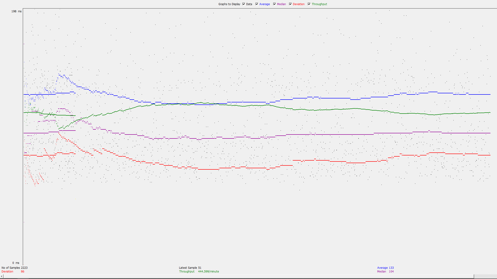
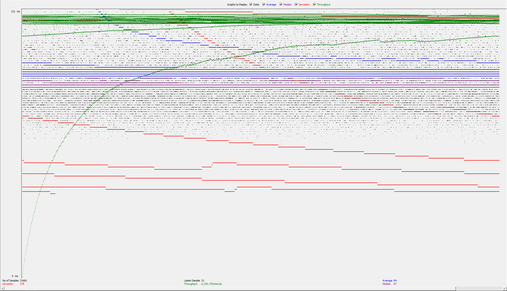
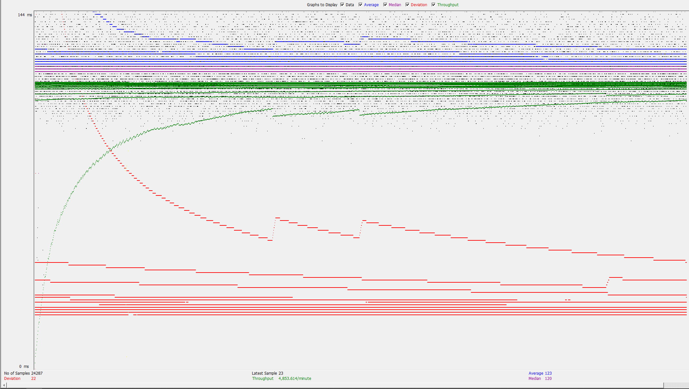
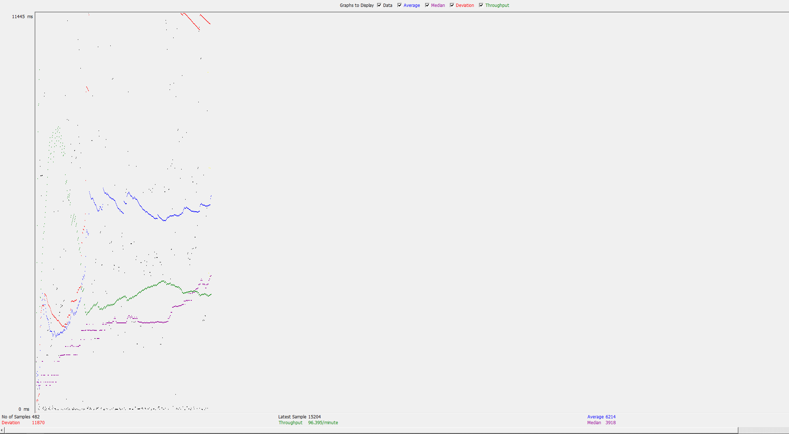
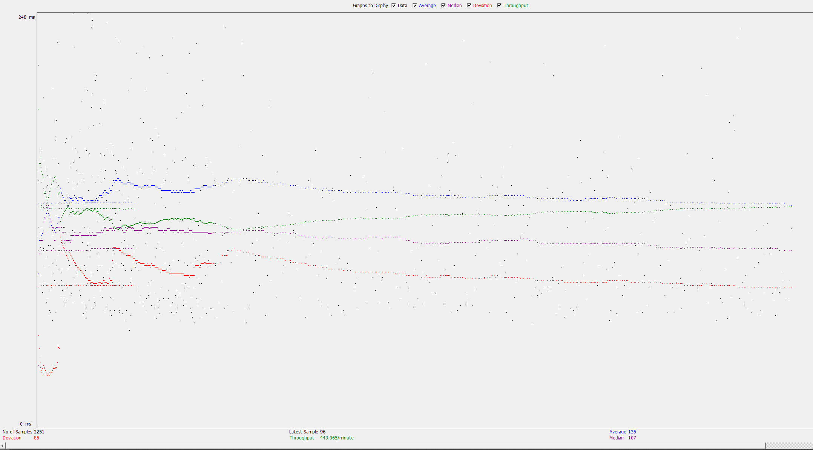
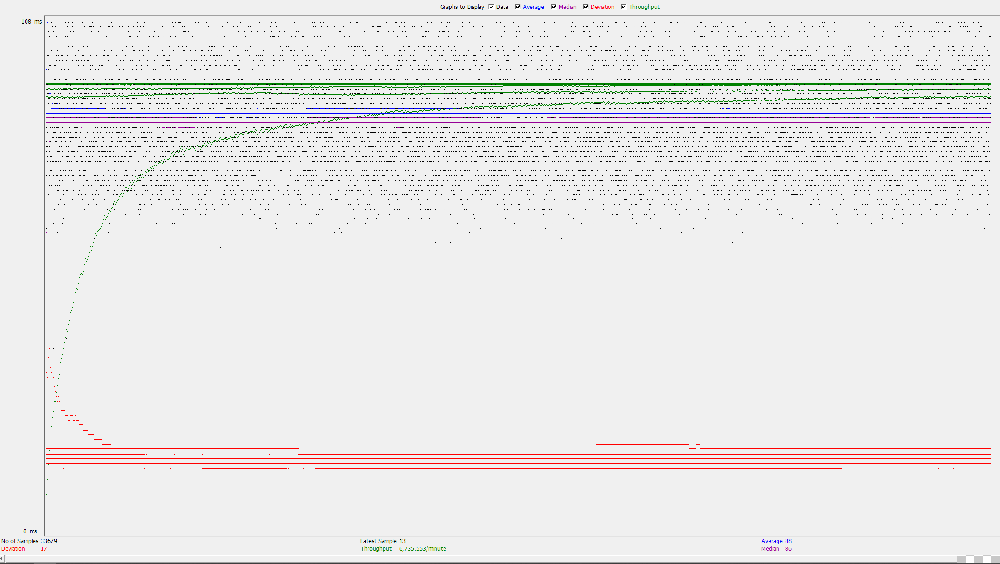
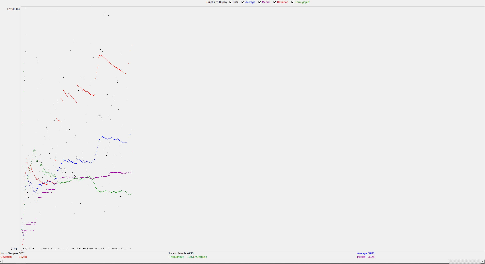

## CS 122B Project Bobaholic Team

This repository build Fablix Movie Project

### Project Demo URLs

#### Project 1: https://www.youtube.com/watch?v=Yx577l4Oh8o

#### Project 2: https://youtu.be/nDvWTj4hUrA

#### Project 3: https://www.youtube.com/watch?v=wsa0w256PfE

#### Project 4: https://youtu.be/SDwas2kEY2E

#### Project 5: https://www.youtube.com/watch?v=d7PkKohW9EQ

### Project Contribution

#### Project 1:

- Trinh Nhu Khang (Jayden) Le:
  - Build Movies Page Frontend and Backend (html, js, java Servlet)
  - Modify Single Star Page Frontend and Backend (html, js, java Servlet)
  - Do final touch on Frontend html and css
- Kashyap Patel:
  - Build Single Movie Page Frontend and Backend (html, js, java Servlet)

#### Project 2:

- Trinh Nhu Khang (Jayden) Le:
  - Implement Login Page
  - Implment Main Page except for SearchServlet (endpoint) and Search on the Frontend
  - Implement Extend Project 1 part
  - Fix bug with shopping cart and update sales table
- Kashyap Patel:
  - Implement SearchServlet (endpoint) and Search on the Frontend
  - Implement Shopping Cart
  
#### Project 3:

- Trinh Nhu Khang (Jayden) Le:
  - Implement Task 1, 2, 3, 4, 5
  - Help with ideas and some implementation for optimize the parser
  - Finalize and record video
- Kashyap Patel:
  - Implement Task 6
  
#### Project 4:
- Trinh Nhu Khang (Jayden) Le:
  - Implement Task 2
  - Finalize and record video
- Kashyap Patel:
  - Implement Task 1

#### Project 5:
- Trinh Nhu Khang (Jayden) Le:
  - Implement Task 2 (Master/Slave)
  - Implement Task 3 (Log Balancing)
  - Finalize and record video
- Kashyap Patel:
  - Implement Task 1 (JDBC Connection Pooling)
  - Implement Task 4 (JMeter plan, log files, processing script)

### Additional Notes

#### Substring Matching Design:

- Used the LIKE operator in the SQL query to perform searching
- Searched for all strings (title, director, star, year) that contained the search keywords
- For example, (? = '' OR m.title LIKE CONCAT('%', ?, '%') looks for whether the parameter ?
  is anywhere in the string or if no keyword search was given
- Used AND logic to combine the four search conditions
- Full search query:  
  SELECT DISTINCT m.id AS id,  
  m.title AS title,  
  m.director AS director,
  m.year AS year,  
  r.rating AS rating  
  FROM movies m  
  JOIN stars_in_movies sm ON m.id = sm.movieId  
  JOIN stars s ON sm.starId = s.id  
  LEFT JOIN ratings r ON m.id = r.movieId  
  WHERE (  
  (? = '' OR m.title LIKE CONCAT('%', ?, '%'))  
  AND (? = '' OR m.director LIKE CONCAT('%', ?, '%'))  
  AND (? = '' OR s.name LIKE CONCAT('%', ?, '%'))  
  AND (? = '' OR m.year = ?)  
  )

#### List of Files that use Prepared Statement:
  - 2023-fall-cs122b-bobaholic/src/script/SAXParser/src/main/java/DatabaseHandler.java
  - 2023-fall-cs122b-bobaholic/src/employee_dashboard/services/DashboardLoginFormService.java
  - 2023-fall-cs122b-bobaholic/src/employee_dashboard/services/AddStarService.java
  - 2023-fall-cs122b-bobaholic/src/main_fablix/services/BrowseByGenreService.java
  - 2023-fall-cs122b-bobaholic/src/main_fablix/services/BrowseByTitleService.java
  - 2023-fall-cs122b-bobaholic/src/main_fablix/services/LoginFormService.java
  - 2023-fall-cs122b-bobaholic/src/main_fablix/services/PaymentService.java
  - 2023-fall-cs122b-bobaholic/src/main_fablix/services/Random3Service.java
  - 2023-fall-cs122b-bobaholic/src/main_fablix/services/SearchService.java
  - 2023-fall-cs122b-bobaholic/src/main_fablix/services/SingleMovieService.java
  - 2023-fall-cs122b-bobaholic/src/main_fablix/services/SingleStarService.java
  - 2023-fall-cs122b-bobaholic/src/main_fablix/services/AutocompleteService.java
  - 2023-fall-cs122b-bobaholic/src/main_fablix/services/MoviesService.java
  - 2023-fall-cs122b-bobaholic/src/main_fablix/services/FullTextSearchService.java
  - 2023-fall-cs122b-bobaholic/src/main_fablix/AllGenresServlet.java

#### XML Parsing Assumptions:
- Only the stars that are in actors.xml are added to the database (not casts.xml)
  
#### Optimization Report:

- Implemented connection pooling using HikariCP. Connection pooling optimizes the management
  of database connections. Instead of opening and closing a new connection for each database
  operation, a pool of connections is maintained. This reduces the overhead of opening and
  closing connections and improves the overall efficiency of database operations.
- Implemented ExecutorService along with submit to run parsers concurrently, taking advantage
  of parallel processing. Concurrent execution of parsers improves overall performance by
  utilizing multiple threads. This allows for better resource utilization, especially in
  scenarios where parsers can execute independently. The ExecutorService manages the threads
  and simplifies the coordination of concurrent tasks.
- Implemented batch processing for inserting records into the database using addBatch and
  executeBatch methods for statements. Batch processing optimizes database insertions by
  grouping multiple SQL statements into a single batch. This reduces the number of round-trips
  between the application and the database, resulting in improved performance.
- Before implementing the above three optimizations, the time to XML parse took around 25 minutes locally.
- After implementing the above three optimizations, the time to XML parse took 7 minutes locally
  for a time reduction of around 18 minutes.

#### Inconsistency Data:

##### Mains Summary:
- Movies Inserted: 12030
- Genres Inserted: 124
- Genres In Movies Inserted: 9797
- Inconsistent Values (Not Inserted): 112
##### Actors Summary:
- Stars Inserted: 6863
- Inconsistent Values (Not Inserted): 73
- Duplicate Stars: 0
##### Casts Summary:
- Stars in Movies Inserted: 32614
- Inconsistent Values (Not Inserted): 755
- Duplicate Stars In Movies: 13683

#### Connection Pooling:

##### Connection Pool Config File:
  - 2023-fall-cs122b-bobaholic/WebContent/META-INF/context.xml

##### List of Files that use Prepared Statement:
  - 2023-fall-cs122b-bobaholic/src/script/SAXParser/src/main/java/DatabaseHandler.java
  - 2023-fall-cs122b-bobaholic/src/employee_dashboard/services/DashboardLoginFormService.java
  - 2023-fall-cs122b-bobaholic/src/employee_dashboard/services/AddStarService.java
  - 2023-fall-cs122b-bobaholic/src/main_fablix/services/BrowseByGenreService.java
  - 2023-fall-cs122b-bobaholic/src/main_fablix/services/BrowseByTitleService.java
  - 2023-fall-cs122b-bobaholic/src/main_fablix/services/LoginFormService.java
  - 2023-fall-cs122b-bobaholic/src/main_fablix/services/PaymentService.java
  - 2023-fall-cs122b-bobaholic/src/main_fablix/services/Random3Service.java
  - 2023-fall-cs122b-bobaholic/src/main_fablix/services/SearchService.java
  - 2023-fall-cs122b-bobaholic/src/main_fablix/services/SingleMovieService.java
  - 2023-fall-cs122b-bobaholic/src/main_fablix/services/SingleStarService.java
  - 2023-fall-cs122b-bobaholic/src/main_fablix/services/AutocompleteService.java
  - 2023-fall-cs122b-bobaholic/src/main_fablix/services/MoviesService.java
  - 2023-fall-cs122b-bobaholic/src/main_fablix/services/FullTextSearchService.java
  - 2023-fall-cs122b-bobaholic/src/main_fablix/AllGenresServlet.java
  
##### Info about Connection Pooling Usage:
  - Connection Pooling is used by all the servlets with Prepared Statements.
  - By adding the line maxTotal="100" maxIdle="30" maxWaitMillis="10000" in context.xml, we are configuring the database to use connection pooling.
  - The line "Connection conn = dataSource.getConnection()" in the services for the servlets make the connection to the database which uses connection pooling as we configured it to.

##### Connection Pooling with two backend SQL:
  - When an application needs to perform a database operation, it requests a connection from the pool. Instead of establishing a new connection, it borrows an existing connection from the pool.
  - In the case of two backend SQL databases, connection pooling can be extended to support load balancing. 
  - The pool is configured to distribute connections evenly between the two databases, helping to optimize resource utilization.
  - This can be seen in the context.xml file: https://github.com/uci-jherold2-fall23-cs122b/2023-fall-cs122b-bobaholic/blob/main/WebContent/META-INF/context.xml

#### Master/Slave:
  - Include the filename/path of all code/configuration files in GitHub of routing queries to Master/Slave SQL.
    + context Resource file: https://github.com/uci-jherold2-fall23-cs122b/2023-fall-cs122b-bobaholic/blob/main/WebContent/META-INF/context.xml
    + DataUtils: https://github.com/uci-jherold2-fall23-cs122b/2023-fall-cs122b-bobaholic/blob/main/src/utils/DatabaseUtil.java
    + main_fablix services:  https://github.com/uci-jherold2-fall23-cs122b/2023-fall-cs122b-bobaholic/tree/main/src/main_fablix/services
    + employee_dashboard services: https://github.com/uci-jherold2-fall23-cs122b/2023-fall-cs122b-bobaholic/tree/main/src/employee_dashboard/services
    
  - How read/write requests were routed to Master/Slave SQL?  
    + All the services inside main_fablix and employee_dashboard use the DataUtils to got the data source of master and slave depending on if it is a read or write operation
    In all the services, a static function inside DataUtils got called with a parameter isReadOperation passed in. If it is used for read operation, it will randomlly choose between Master or Slave mysql datasource. If it is used for write operation, it will return the datasource that coresponding to Master mysql instances.

#### JMeter TS/TJ Time Logs:
  - The JMeter Time logs can be found under /src/logs.
  - The log_processing.py file can be found under /src/script.
   
##### Instructions on how to run log_processing.py script:
  - Put your log file in the same directory with the log_processing.py file
  - in the terminal, navigate to that folder and run: python (or python3 depend on your OS) log_processing.py <file_name>

#### JMeter TS/TJ Time Measurement Report:

| **Single-instance Version Test Plan**          | **Graph Results Screenshot** | **Average Query Time(ms)** | **Average Search Servlet Time(ms)** | **Average JDBC Time(ms)** | **Analysis** |
|------------------------------------------------|------------------------------|----------------------------|-------------------------------------|---------------------------|--------------|
| Case 1: HTTP/1 thread                          |        | 133                        | 10.70                               | 9.93                      | This is the base test from which we can analyze how changing certain parameters affect the time measurement           |
| Case 2: HTTP/10 threads                        |        | 94                         | 17.30                               | 16.65                     | Using more threads results in a quicker query, search, JDBC time           |
| Case 3: HTTPS/10 threads                       |        | 123                        | 15.71                               | 15.04                     | When using HTTPS, the query, search, and JDBC times are slightly slower but it's not a big difference           |
| Case 4: HTTP/10 threads/No connection pooling  |        | 6124                       | 6639.07                             | 6636.64                   | Without connection pooling, the query, search, and JDBC times are significantly slower            |

| **Scaled Version Test Plan**                   | **Graph Results Screenshot** | **Average Query Time(ms)** | **Average Search Servlet Time(ms)** | **Average JDBC Time(ms)** | **Analysis** |
|------------------------------------------------|------------------------------|----------------------------|-------------------------------------|---------------------------|--------------|
| Case 1: HTTP/1 thread                          |        | 135                        | 10.08                               | 9.45                      | Using a scaled version instead of single-instance version results in little to no difference in time          |
| Case 2: HTTP/10 threads                        |        | 88                         | 18.19                               | 17.96                     | Using more threads results in a quicker query, search, JDBC time again in the scaled version as well           |
| Case 3: HTTP/10 threads/No connection pooling  |        | 5980                       | 6191.40                             | 6189.19                   | Without connection pooling, the query, search, and JDBC times are significantly slower but the scaled version without pooling is slightly better than the single-instance without pooling           |
